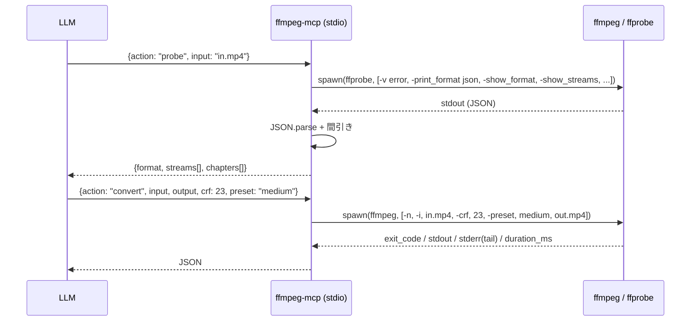

<div align="center">

# ffmpeg-mcp

### ffmpeg / ffprobe を安全な引数渡しで LLM から叩く MCP サーバー

[](src/index.ts)
[](package.json)
[](https://ffmpeg.org/)
[](https://modelcontextprotocol.io/)
[](LICENSE)

**シェル文字列を組み立てずに ffmpeg を駆動する。probe は構造化 JSON で返す。**

---

</div>

## 概要

LLM に `ffmpeg -i ... -c:v libx264 ...` を文字列として書かせると、エスケープ事故・シェルインジェクション・クォート漏れが起きる。このサーバーは**全ての引数を配列で渡し、`spawn` でシェルを経由せずに起動する**。ffprobe は常に `-print_format json` で叩いて、LLM に渡す前に構造化する。

| 要素 | 実装 |
|---|---|
| トランスポート | stdio MCP |
| 子プロセス | `spawn(ffmpeg\|ffprobe, args[])` — シェル不使用 |
| 出力制御 | stderr 末尾 16 KB だけ残す (ffmpeg は verbose) |
| タイムアウト | 既定 600 s、`FFMPEG_TIMEOUT` または `timeout` 引数で上書き |

## 特徴

| アクション | 用途 |
|---|---|
| `probe` | ffprobe を JSON で叩き、format / streams / chapters を間引いて返す（未知ファイルへの第一手） |
| `convert` | 再エンコード。`video_codec` / `audio_codec` / `crf` / `preset` / `video_bitrate` / `audio_bitrate` / `fps` / `resolution=[w,h]` / オプションの `start`・`duration` / `extra_args` |
| `trim` | 既定で `-c copy` による**無劣化カット**（再エンコードなし、ほぼ瞬時）。`copy: false` で再エンコード可。**精度注意**: copy モードは I-frame 単位で seek する為、`start` が最大数秒ズレる事がある（ffmpeg の仕様）。フレーム精度が必要なら `copy: false` |
| `concat` | concat デマクサで `input_paths: string[]` を無劣化結合（全入力が同コーデック/同パラメータ前提） |
| `extract_audio` | `-vn` + オプションで `audio_codec` / `audio_bitrate`。拡張子でコーデック自動選択 |
| `thumbnail` | 指定時刻（既定 `00:00:01`）の 1 フレームを画像として書き出し、`size=[w,h]` で縮小可 |
| `run` | 生 args の escape hatch。`use_ffprobe: true` で ffprobe を叩く |
| `version` | `ffmpeg -version` / `ffprobe -version` の先頭行 |
| `watermark` | ロゴ画像を動画にオーバーレイ。`position` (top-left / top-right / bottom-left / bottom-right / center), `margin`, `watermark_scale` (メイン動画幅に対する比, デフォルト 0.15), `opacity` |
| `loudnorm` | **EBU R128 2-pass ラウドネス正規化**。1 パス目で measured_I / TP / LRA / thresh / offset を取得、2 パス目で linear モードで再エンコード。`target_i` (-16), `target_tp` (-1.5), `target_lra` (11) がデフォルト |
| `speed` | 再生速度変更。`setpts=PTS/speed` + `atempo` チェーン (0.5〜2.0 超える倍率も自動チェーン化)。`video_only` / `audio_only` で片方だけ |
| `batch` | `jobs[]` を sequential 実行。`stop_on_error` で中断制御、各ジョブの ok/exit_code/duration/stderr テイルを個別レポート |

## 処理フロー



## インストール

```bash
git clone https://github.com/cUDGk/ffmpeg-mcp.git
cd ffmpeg-mcp
npm install
npm run build
```

ffmpeg と ffprobe が PATH にある事が前提。別パスにある場合は `FFMPEG_PATH` / `FFPROBE_PATH` で明示する。

## 使い方

### Claude Code に登録

```bash
claude mcp add ffmpeg -- node <install-dir>/dist/index.js
```

### 環境変数

| 変数 | デフォルト | 用途 |
|---|---|---|
| `FFMPEG_PATH` | `ffmpeg` | ffmpeg 実行ファイル |
| `FFPROBE_PATH` | `ffprobe` | ffprobe 実行ファイル |
| `FFMPEG_TIMEOUT` | `600000` | 単一呼び出しのタイムアウト (ms) |
| `FFMPEG_MCP_ALLOW_ROOTS` | (未設定) | 出力先のホワイトリスト（OS の `path.delimiter` 区切り — Windows は `;`、POSIX は `:`）。設定すると、ここで挙げたディレクトリ配下にしか出力できない |
| `FFMPEG_MCP_MAX_JOBS` | `32` | `batch.jobs[]` の上限 |

`FFMPEG_MCP_ALLOW_ROOTS` の例:

```powershell
# Windows (PowerShell): 区切りは ";"
$env:FFMPEG_MCP_ALLOW_ROOTS = "C:\Users\me\videos;D:\renders"
```

```bash
# Linux / macOS: 区切りは ":"
export FFMPEG_MCP_ALLOW_ROOTS="/home/me/videos:/srv/renders"
```

### セキュリティ

- **既定で出力ファイルは上書きしない (`ffmpeg -n`)**。意図的に上書きしたい場合は `overwrite: true` を渡す（`ffmpeg -y`）。
- **`run` / `convert.extra_args` は無検査ではない**。ffmpeg のプロトコルプレフィックス (`concat:`, `subfile:`, `http:`, `file:`, `tee:`, `data:` 等) や、ファイルを読む系のフィルタ (`movie=...`, `subtitles=...`, `drawtext=...textfile=...`, `sendcmd=...`) や、`-protocol_whitelist` 上書き / `-f tee` は拒否する。それ以外の動作については LLM 任せにせず、ホスト側でも `FFMPEG_MCP_ALLOW_ROOTS` を設定する事を推奨する。
- 全ての `-i` 呼び出しに `-protocol_whitelist file,crypto,data` を強制注入する（HTTP/RTMP/RTSP 経由の任意 URL fetch を遮断する）。

### 呼び出し例

未知ファイルの確認 → 中央 10 秒を切り出し → H.264 に再圧縮:

```json
{"action": "probe", "input": "C:/tmp/raw.mkv"}

{"action": "trim", "input": "C:/tmp/raw.mkv", "output": "C:/tmp/clip.mkv",
 "start": "00:01:00", "duration": 10}

{"action": "convert", "input": "C:/tmp/clip.mkv", "output": "C:/tmp/out.mp4",
 "video_codec": "libx264", "crf": 23, "preset": "medium",
 "audio_codec": "aac", "audio_bitrate": "128k"}
```

サムネイル 4 枚（0 / 10 / 20 / 30 秒）:

```json
{"action": "thumbnail", "input": "in.mp4", "output": "t0.jpg", "time": 0, "size": [640, 360]}
{"action": "thumbnail", "input": "in.mp4", "output": "t1.jpg", "time": 10, "size": [640, 360]}
{"action": "thumbnail", "input": "in.mp4", "output": "t2.jpg", "time": 20, "size": [640, 360]}
{"action": "thumbnail", "input": "in.mp4", "output": "t3.jpg", "time": 30, "size": [640, 360]}
```

ラウドネス正規化 (podcast / YouTube 公開用):

```json
{"action": "loudnorm", "input": "raw.wav", "output": "normalized.m4a",
 "target_i": -14, "target_tp": -1.0, "target_lra": 7,
 "audio_codec": "aac", "audio_bitrate": "192k"}
```

ロゴ透かし (右上 10% サイズ、60% 透過):

```json
{"action": "watermark", "input": "in.mp4", "output": "out.mp4",
 "watermark_path": "logo.png",
 "position": "top-right", "margin": 20,
 "watermark_scale": 0.1, "opacity": 0.6}
```

2x 早回し:

```json
{"action": "speed", "input": "in.mp4", "output": "2x.mp4", "speed_factor": 2.0}
```

複数動画を一括処理 (最初の失敗で中断):

```json
{"action": "batch", "stop_on_error": true, "jobs": [
  {"action": "trim", "input": "raw.mp4", "output": "clip.mp4", "start": 10, "duration": 30},
  {"action": "convert", "input": "clip.mp4", "output": "final.mp4", "video_codec": "libx264", "crf": 20},
  {"action": "thumbnail", "input": "final.mp4", "output": "poster.jpg", "time": 5}
]}
```

`run` で完全制御（例: フィルタ複雑グラフ）:

```json
{"action": "run", "args": [
  "-y", "-i", "in.mp4",
  "-filter_complex", "[0:v]scale=1280:720,fps=30[v]",
  "-map", "[v]", "-map", "0:a",
  "-c:v", "libx264", "-crf", "20",
  "out.mp4"
]}
```

## 設計メモ

- **意図ベースのアクション（`convert_to_mp4` 等）を増やさない**。増やしても結局 `extra_args` で逃げるだけで、LLM に覚えさせる面が増える。アクションは**処理のカテゴリ単位**（convert / trim / concat / thumbnail）に留める。
- **stderr は末尾 16 KB だけ残す**。ffmpeg は 1 回の実行で数 MB のログを吐く事があり、LLM のコンテキストを焼き尽くす。
- **相対パスは CWD から resolve**。LLM が相対パスを渡しても意図通りの場所に書き出される。
- **タイムアウト既定 10 分**。長時間エンコードは `timeout` で上書き。

## v0.3.1 修正

バグ修正:
- `batch` の `watermark` ジョブで `watermark_path` → `watermark` / `watermark_scale` → `scale` のフィールドマッピングが欠落していた問題を修正（ウォーターマーク画像と scale が常に無視されていた）。
- `batch` の `speed` ジョブで `speed_factor` → `speed` のフィールドマッピングが欠落していた問題を修正（`speed` が undefined になり `Number.isFinite` チェックで必ずエラーになっていた）。
- README の mermaid ダイアグラムで `-y` と表示されていたのを `-n` (no-clobber デフォルト) に修正。

## v0.3.0 修正

セキュリティ・バグ・UX を一括で改修したリリース。

セキュリティ:
- `run` / `convert.extra_args` の引数を `assertSafeFfmpegArgs()` で検査。ffmpeg プロトコルプレフィックス・ファイル読み取り系フィルタ・`-protocol_whitelist` 上書き・`-f tee` を拒否。
- 全ての `-i` 呼び出しに `-protocol_whitelist file,crypto,data` を強制注入。
- `safeInputPath()` を全アクションの入力に適用（Windows ドライブレター `C:\...` は許可、`http:` / `concat:` 等は拒否）。
- 既定値を `-y` (force overwrite) → `-n` (no clobber) に変更。明示的に `overwrite: true` を渡した時だけ上書きする。
- `FFMPEG_MCP_ALLOW_ROOTS` で出力先をディレクトリ単位でホワイトリスト可能。
- `FFMPEG_MCP_MAX_JOBS` で `batch.jobs[]` の長さに上限。
- `concat` のリストファイルに改行を含むエントリを拒否（行ベースパーサを破壊する為）。

バグ修正:
- stdout / stderr を `Buffer.concat()` で組み立てる様に変更（チャンク境界で UTF-8 が壊れる問題を解消）。
- stdout にも 8 MiB の上限を導入。
- `loudnormPass1` の stderr を切り詰めない。loudnorm の JSON ブロックが落ちる事があった。
- `loudnormPass1` が `timeout` を尊重していなかった問題を修正。
- `concat()` の `mkdtempSync` を try の中に移動。例外時の temp dir リーク防止。
- `proc.stdout` / `proc.stderr` に `error` リスナを追加（Windows での EPIPE 未処理を防止）。
- `killProc` を非同期化（`execFileSync` でイベントループを止めない）。
- `speed` で `setpts=Infinity*PTS` を防ぐバリデーション。
- `version` の戻り値が空 / 非 0 終了時に `isError: true` を立てる様に。
- `tsconfig.json` に `noUncheckedIndexedAccess: true`。

UX:
- ツール説明に `watermark` / `loudnorm` / `speed` / `batch` を追記。
- `thumbnail` のデフォルト `time` をドキュメント通りの `00:00:01` に。
- `batch.jobs[].action` を厳密な enum に。
- `batch` で 1 件でも失敗したら全体の `isError` を立てる。
- `extra_args` が convert 専用である事を明記。

## v0.2.1 修正

一部の MCP クライアント (Claude Code の LLM ツール使用パス等) が **object / array 引数を JSON 文字列化してからサーバーに渡す**挙動があり、`extra_args` / `args` / `input_paths` / `resolution` / `size` / `jobs` が文字列で届くと zod バリデーションで落ちるか、`args.push(...p.extra_args)` で文字列を spread して 1 文字ずつ ffmpeg の引数に混入する等の事故が起きていた。

修正内容:
- `extra_args` / `args` / `input_paths` / `resolution` / `size` / `jobs` の zod schema を `z.union([<本来の型>, z.string()])` に緩和
- `coerceArray()` / `coerceObject()` ヘルパを追加し、文字列で届いた場合は `JSON.parse` で配列 / オブジェクトに戻してから使用
- `batch` の各 job 内部のネスト配列 (`extra_args` / `resolution` / `size` / `args` / `input_paths`) も coerce してから dispatch

## Attribution

- [FFmpeg](https://ffmpeg.org/) © FFmpeg developers（LGPL/GPL）— 本 MCP はラッパーであり FFmpeg 本体のライセンスに従う
- [Model Context Protocol](https://modelcontextprotocol.io/) — 仕様・SDK

## ライセンス

MIT License © 2026 cUDGk — 詳細は [LICENSE](LICENSE) を参照。
